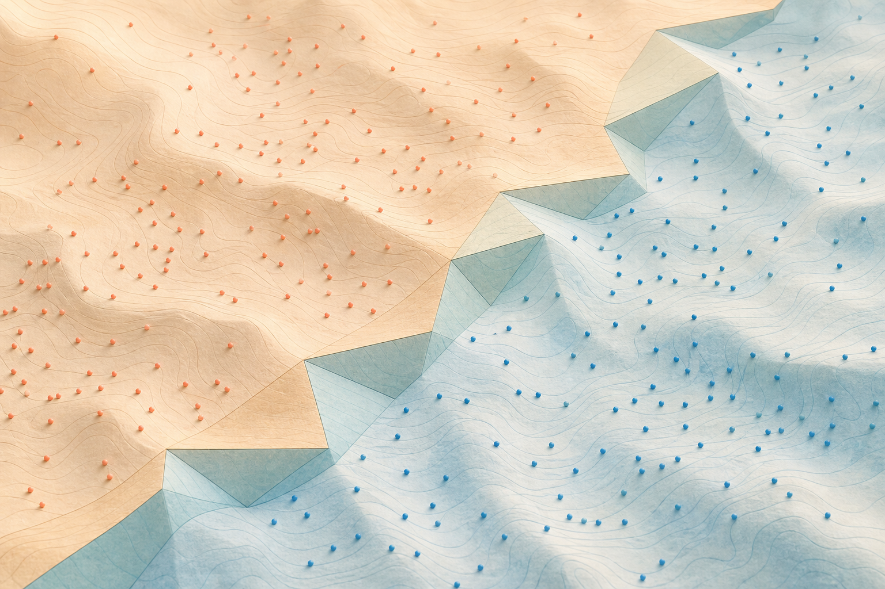

# Tropical Algebra of ReLU Networks

**A ReLU neural network is literally a tropical rational map.** We take
that statement seriously. First we set up the max-plus (tropical)
semiring from scratch and walk through three classical applications —
shortest paths, project scheduling, and Karp's eigenvalue. Then we
show that a 1-hidden-layer ReLU classifier is a difference of two
tropical polynomials, derive that fact symbolically on small examples,
and finally train an actual classifier in WL and display its decision
boundary as a tropical hypersurface.

Companion code: <https://github.com/mthiel74/TropicalAlgebravsReLU>.

Reference: L. Zhang, G. Naitzat, L.-H. Lim, *Tropical Geometry of Deep
Neural Networks*, ICML 2018.
[arXiv:1805.07091](https://arxiv.org/abs/1805.07091).


*Two windows on two algebras. Left: the smooth, continuous world of
classical arithmetic $(\mathbb{R}, +, \cdot)$. Right: the same
landscape under $(\max, +)$ — everything piecewise-linear, every
operation produces a crisp polyhedral surface.*

---

## 1. Max-plus algebra in 60 seconds

The tropical (max-plus) semiring is $\mathbb{R}_\max = \mathbb{R} \cup
\{-\infty\}$, equipped with two operations that look like the addition
and multiplication of classical algebra but are:

$$a \oplus b := \max(a, b), \qquad a \otimes b := a + b.$$

The identities flip: the additive identity is $-\infty$ (since
$\max(-\infty, a) = a$), and the multiplicative identity is $0$
(since $0 + a = a$). Apart from the lack of additive inverses, every
familiar axiom carries over — distributivity in particular:

$$a \otimes (b \oplus c) = (a \otimes b) \oplus (a \otimes c).$$

**Operators in WL.** `\[CirclePlus]` (Esc-c-p-Esc), `\[CircleTimes]`
(Esc-c-t-Esc), and `\[CircleDot]` (Esc-c-.-Esc). We attach the
definitions to the `System`` symbols once so the infix syntax just
works:

```mathematica
Unprotect[System`CirclePlus, System`CircleTimes, System`CircleDot];

System`CirclePlus[a_, b_]   := Max[a, b];
System`CirclePlus[a_, b__]  := Max[a, b];
SetAttributes[System`CirclePlus, {Listable, Flat, OneIdentity, Orderless}];

System`CircleTimes[a_, b_]  := a + b;
System`CircleTimes[a_, b__] := Plus[a, b];
SetAttributes[System`CircleTimes, {Listable, Flat, OneIdentity, Orderless}];

System`CircleDot[A_?MatrixQ, B_?MatrixQ] := Inner[Plus, A, B, Max];
System`CircleDot[A_?MatrixQ, v_?VectorQ] := Inner[Plus, A, v, Max];
System`CircleDot[v_?VectorQ, A_?MatrixQ] := Inner[Plus, v, A, Max];

Protect[System`CirclePlus, System`CircleTimes, System`CircleDot];

{3 \[CirclePlus] 7,  3 \[CircleTimes] 7,  {1, 2, 3} \[CirclePlus] {4, 0, 5}}
(* {7,  10,  {4, 2, 5}} *)
```

The companion `MaxPlus.wl` package in the repo also defines
`MPIdentity`, `MPMatrixPower`, `KleeneStar`, `MPDeterminant`,
`MPCycleMean` (Karp), `TropicalPolynomial`, `NewtonPolytope`,
`MPSchedule`, and a `ReLUToTropicalRational` converter.

## 2. Tropical matrices, identity, Kleene star

A tropical matrix is just a real matrix; what changes is the
multiplication. The identity has $0$ on the diagonal and $-\infty$
everywhere else. The Kleene star of $A$ is

$$A^* := I_n \oplus A \oplus A^{\otimes 2} \oplus A^{\otimes 3} \oplus \cdots$$

i.e. the matrix whose $(i, j)$ entry is the largest-weight path from
$i$ to $j$ over any number of steps. On a graph with no positive-weight
cycles the series stabilises after at most $n - 1$ products.

## 3. Classical application 1 — shortest paths

The Bellman–Ford recurrence $d_{t+1}(v) = \min_u \bigl(d_t(u) +
\text{cost}(u, v)\bigr)$ is, in min-plus algebra, literally a
matrix–vector product:

$$d_{t+1} = d_t \odot \text{cost}.$$

So the Kleene star of the cost matrix (negated, to flip $\max$ to
$\min$) gives the full all-pairs distance matrix in one shot.


*A directed network with edge weights; the dim edges are the full
graph, the glowing coral curve is the cheapest path between two nodes
— what the tropical mat-vec is selecting.*


## 4. Classical application 2 — project scheduling

`n` tasks with durations $d_i$ and a precedence DAG. The earliest
completion time of each task is the longest path from any source to
that task plus its own duration — a tropical mat-vec / Kleene star,
this time with Max for $\oplus$.


## 5. Tropical polynomials and the Newton polytope

A *tropical polynomial* in $d$ variables is

$$p(x_1, \dots, x_d) = \max_i \,(a_i \cdot x + c_i),$$

with exponent vectors $a_i$ and real coefficients $c_i$. It is convex
piecewise-linear by construction. The convex hull of the exponents is
the Newton polytope; lifting each $a_i$ to $(a_i, c_i)$ and taking the
*upper* convex hull induces a regular subdivision of the Newton
polytope. That subdivision is **dual** to the linear-region
decomposition of input space induced by $p$.

Only monomials whose lifted point sits on the upper hull contribute a
region. Interior monomials are dominated everywhere and never realise
the max.


In two variables the same picture holds with the upper hull a
2D-polytope's set of facets:


## 6. Tropical eigenvalues — Karp's algorithm

For a square tropical matrix $A$ the role of the eigenvalue is played
by the *maximum mean cycle weight*:

$$\lambda_{\max}(A) = \max_{\text{cycles } C}\,\frac{\text{sum of edge weights in } C}{\text{length of } C}.$$

Karp's algorithm computes it in $O(n^3)$.


The iterates $x_{t+1} = A \odot x_t$ then grow at rate $\lambda_{\max}$
per step.

---

## 7. ReLU = the tropical sum $0 \oplus x$

Everything above stands on its own. Now we cross over to neural
networks. The bridge: **ReLU is the unit operation of the max-plus
semiring**:

$$\text{ReLU}(x) = \max(0, x) = 0 \oplus x.$$

A single ReLU unit on a pre-activation $a \cdot x + b$ is therefore
the smallest possible degree-1 tropical polynomial:

$$h(x) = 0 \oplus (a x + b) = \max(0, a x + b).$$


## 8. The decisive identity

A 1-hidden-layer ReLU classifier is a *classical sum* of ReLU units.
The identity that turns that classical sum into a single tropical
polynomial is

$$\max(0, A) + \max(0, B) = \max(0, A, B, A + B).$$

Read tropically:

$$(0 \oplus A) \otimes (0 \oplus B) = 0 \oplus A \oplus B \oplus (A \otimes B).$$

The classical sum of two ReLU units is the *tropical product* of their
tropical polynomials — each contributing two monomials, the product
giving four. This is the engine behind everything that follows.

## 9. Symbolic derivation: $2 \to 1 \to 1$ network

The smallest non-trivial classifier has 1 hidden unit. With weights
$a, b$, bias $c$, output weight $w$, output bias $e$:

$$h = \max(0,\, a x_1 + b x_2 + c), \qquad f = w h + e.$$

**Case 1.** $w > 0$. Pull $w$ inside the Max because it is
non-negative: $w \max(\alpha, \beta) = \max(w\alpha, w\beta)$. So

$$f = \max\bigl(e,\, w(a x_1 + b x_2 + c) + e\bigr),$$

which is $P(x) - Q(x)$ with $Q \equiv 0$ and $P$ a tropical polynomial
of degree 1 (two monomials).

**Case 2.** $w < 0$. Write $w = -|w|$. Then $-|w| \cdot \max(0, \ell)
= -\max(0, |w|\,\ell)$, so

$$f = e - \max\bigl(0,\, |w|(a x_1 + b x_2 + c)\bigr),$$

which is $P(x) - Q(x)$ with $P \equiv e$ and $Q$ a tropical polynomial
of degree 1. In both cases the decision boundary $\{f = 0\}$ is the
locus $\{P = Q\}$ — the tropical hypersurface.

## 10. Two hidden units

With two hidden units we can already produce a non-trivial tropical
rational (mixed signs) or a tropical polynomial with **four**
monomials (both signs positive). Take $h_j = \max(0, a_j x_1 + b_j x_2
+ c_j)$ and $f = w_1 h_1 + w_2 h_2 + e$.

**Both weights positive.** Apply the identity of §8 to the two units:

$$P(x) = \max\bigl(e,\;w_1 \ell_1 + e,\;w_2 \ell_2 + e,\;w_1 \ell_1 + w_2 \ell_2 + e\bigr),$$

where $\ell_j = a_j x_1 + b_j x_2 + c_j$. The four monomials have
exponents $\{(0, 0), (w_1 a_1, w_1 b_1), (w_2 a_2, w_2 b_2),
(w_1 a_1 + w_2 a_2, w_1 b_1 + w_2 b_2)\}$ — the Minkowski sum of the
two single-unit Newton segments and the origin.

**Mixed signs** ($w_1 > 0, w_2 < 0$):

$$P(x) = \max\bigl(e,\, w_1 \ell_1 + e\bigr), \qquad Q(x) = \max\bigl(0,\, |w_2|\, \ell_2\bigr).$$

A proper tropical rational. Adding more hidden units of the same sign
tropical-multiplies into $P$ (or $Q$), doubling the monomial count in
the worst case.

## 11. Train a tiny classifier and verify

Two-moons dataset, $2 \to 12 \to 1$ ReLU MLP, `NetTrain`, then the two
forward passes side-by-side. The full code is in the notebook; the
critical fragment is

```mathematica
fReLU[x_]    := c . Map[Max[0, #] &, A . x + b] + d;

fMaxPlus[x_] := Module[{P, Q},
  P = Sum[If[c[[j]] > 0,
              Max[0, c[[j]] (A[[j]] . x) + c[[j]] b[[j]]], 0],
           {j, Length[c]}] + Max[d, 0];
  Q = Sum[If[c[[j]] < 0,
              Max[0, -c[[j]] (A[[j]] . x) - c[[j]] b[[j]]], 0],
           {j, Length[c]}] + Max[-d, 0];
  P - Q
];
```

The two evaluators agree at machine precision on the three datasets:


## 12. Decision boundary = tropical hypersurface

The $n$ hidden units cut input space along $n$ straight crease lines
$a_j \cdot x + b_j = 0$. On each open region of that arrangement the
activation pattern $\sigma \in \{0, 1\}^n$ is constant and $f$ is
affine. The decision boundary $\{f = 0\}$ is the locus where the two
convex piecewise-linear surfaces $P$ and $Q$ meet.




## 13. Newton polytope of the trained network


The tropical polynomial $P$ of the trained moons network has 7
monomials, of which only 4 land on the upper hull and so realise a
linear piece on the plane. The other 3 are dominated everywhere.

## 14. Linear regions scale like $n^2$

By Zaslavsky's theorem, $n$ straight lines in general position in
$\mathbb{R}^2$ partition the plane into at most

$$Z(n) = 1 + n + \binom{n}{2} = \frac{n^2 + n + 2}{2}$$

regions — the Zhang–Naitzat–Lim upper bound for a 1-hidden-layer ReLU
classifier with 2D input.


The empirical curve tracks the bound at slope $\approx 2$ on log-log
axes.

---

## Take-away in one table

| classical / ReLU view              | tropical / max-plus view                       |
|------------------------------------|------------------------------------------------|
| `max(0, W x + b)` per layer        | tropical polynomial in $x$                     |
| scalar output $f(x) \in \mathbb{R}$| $P(x) - Q(x)$ with $P, Q$ tropical polys       |
| decision boundary $\{f = 0\}$      | tropical hypersurface $\{P = Q\}$              |
| activation crease lines            | regular subdivision of $\text{Newt}(P \oplus Q)$|
| linear regions vs width            | Zaslavsky $1 + n + \binom{n}{2}$               |
| matrix-vector $W x + b$            | tropical mat-vec $A \odot x \otimes b$         |
| Bellman–Ford for shortest paths    | the *same* tropical mat-vec (min-plus)         |
| PERT longest path                  | tropical Kleene star                           |

Everything that ReLU networks do, max-plus algebra **already** does.
The two are the same object viewed through two different operator keys.

## References

- L. Zhang, G. Naitzat, L.-H. Lim. *Tropical Geometry of Deep Neural Networks*. ICML 2018. [arXiv:1805.07091](https://arxiv.org/abs/1805.07091).
- D. Maclagan, B. Sturmfels. *Introduction to Tropical Geometry*. AMS GSM 161 (2015).
- P. Butković. *Max-linear Systems: Theory and Algorithms*. Springer (2010).
- Wolfram Community discussion on max-plus algebra: <https://community.wolfram.com/groups/-/m/t/162609>.
- Companion repository: <https://github.com/mthiel74/TropicalAlgebravsReLU>.
