# Tropical Algebra of ReLU Networks

**A ReLU neural network is literally a tropical rational map.** We
take that statement seriously. First we set up the max-plus (tropical)
semiring from scratch and run it through three classical applications
— shortest paths, project scheduling, and Karp's eigenvalue. Then we
show that a 1-hidden-layer ReLU classifier is a difference of two
tropical polynomials, derive that fact symbolically on small examples,
and finally train an actual classifier in Wolfram Language and display
its decision boundary as a tropical hypersurface.

Companion code: <https://github.com/mthiel74/TropicalAlgebravsReLU>.

Reference: L. Zhang, G. Naitzat, L.-H. Lim, *Tropical Geometry of Deep
Neural Networks*, ICML 2018.
[arXiv:1805.07091](https://arxiv.org/abs/1805.07091)

---

## 1. Max-plus algebra in 60 seconds

The tropical (max-plus) semiring is the set of real numbers extended
with negative infinity, equipped with

```
a ⊕ b := max(a, b)        (the tropical "sum")
a ⊗ b := a + b            (the tropical "product")
```

The identities flip from `{0, 1}` to `{−∞, 0}`. Apart from the lack of
additive inverses, all the familiar axioms hold.

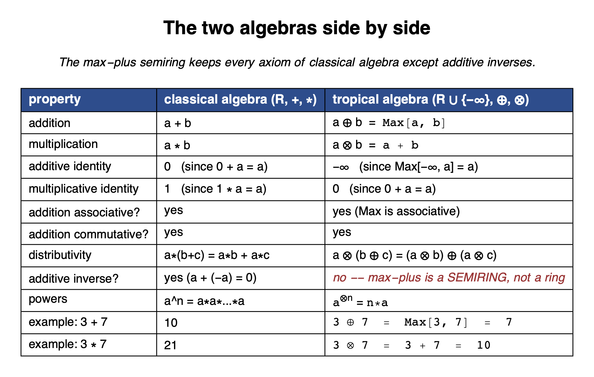

In Wolfram Language we attach the operators to the System` symbols
once and the standard infix syntax just works:

```mathematica
Unprotect[System`CirclePlus, System`CircleTimes, System`CircleDot];

System`CirclePlus[a_, b_]      := Max[a, b];
System`CirclePlus[a_, b__]     := Max[a, b];
SetAttributes[System`CirclePlus, {Listable, Flat, OneIdentity, Orderless}];

System`CircleTimes[a_, b_]     := a + b;
System`CircleTimes[a_, b__]    := Plus[a, b];
SetAttributes[System`CircleTimes, {Listable, Flat, OneIdentity, Orderless}];

System`CircleDot[A_?MatrixQ, B_?MatrixQ] := Inner[Plus, A, B, Max];
System`CircleDot[A_?MatrixQ, v_?VectorQ] := Inner[Plus, A, v, Max];
System`CircleDot[v_?VectorQ, A_?MatrixQ] := Inner[Plus, v, A, Max];

Protect[System`CirclePlus, System`CircleTimes, System`CircleDot];

{3 ⊕ 7, 3 ⊗ 7, {1, 2, 3} ⊕ {4, 0, 5}}
(* ==>  {7, 10, {4, 2, 5}} *)
```

The full self-contained `MaxPlus.wl` package in the repo also defines
`MPIdentity`, `MPMatrixPower`, `KleeneStar`, `MPDeterminant`,
`MPCycleMean` (Karp), `TropicalPolynomial`, `NewtonPolytope`,
`MPSchedule`, and a `ReLUToTropicalRational` converter.

## 2. Classical application — shortest paths

The Bellman–Ford recurrence `d_{t+1}(v) = min_u (d_t(u) + cost(u, v))`
is, in min-plus algebra, literally a matrix–vector product. So
`KleeneStar` of the cost matrix gives the full all-pairs distance
matrix in one shot.

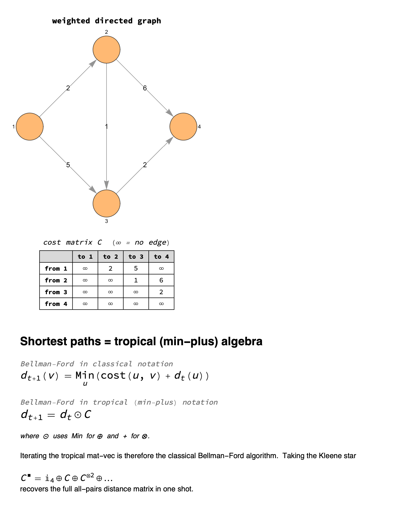
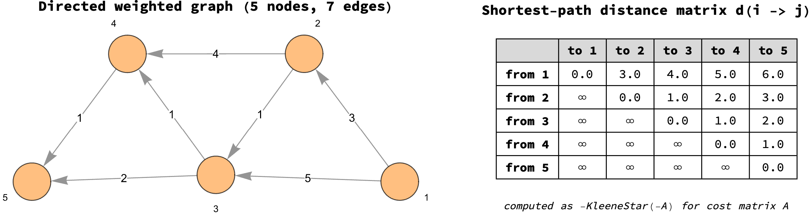

## 3. Classical application — project scheduling

`n` tasks with durations `d_i` and a precedence DAG. The earliest
completion time of each task is the longest path from any source to
that task plus its own duration — again a tropical Kleene-star
computation.

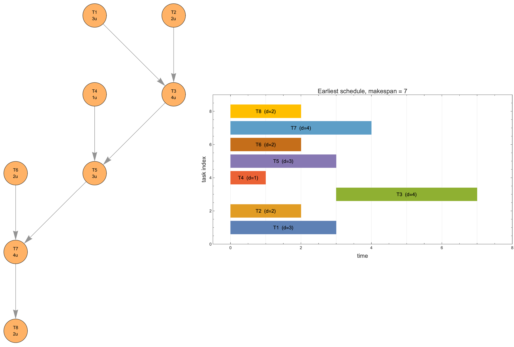

## 4. Tropical polynomials and the Newton polytope

A *tropical polynomial* in `d` variables is `p(x) = max_i (a_i · x + c_i)`.
It is convex piecewise-linear by construction. Only monomials whose
lifted point `(a_i, c_i)` sits on the *upper* convex hull contribute a
non-empty region to the envelope.

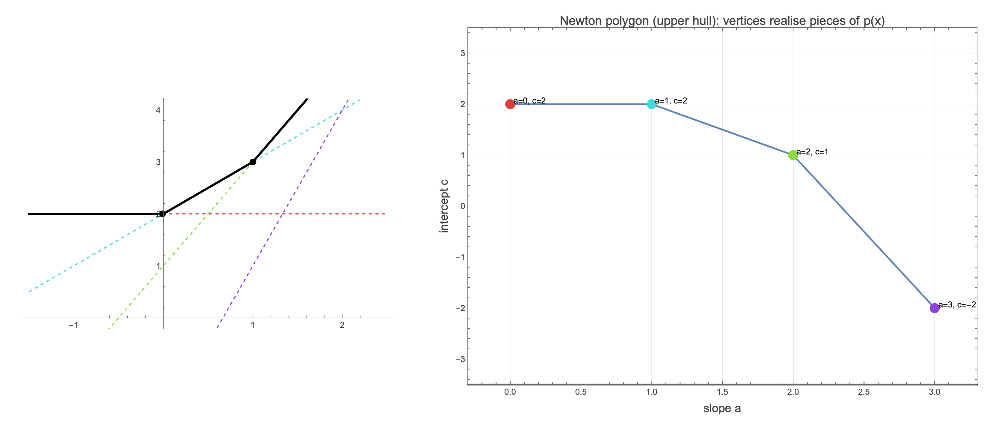
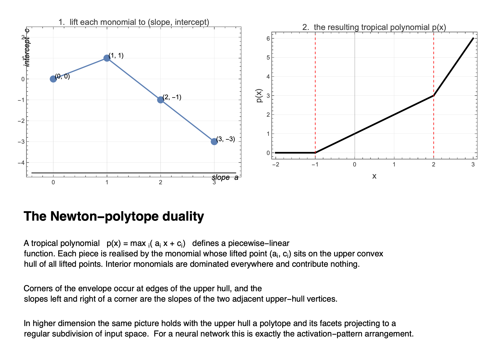

In two variables the same picture holds with the upper hull a
2D-polytope's set of facets:

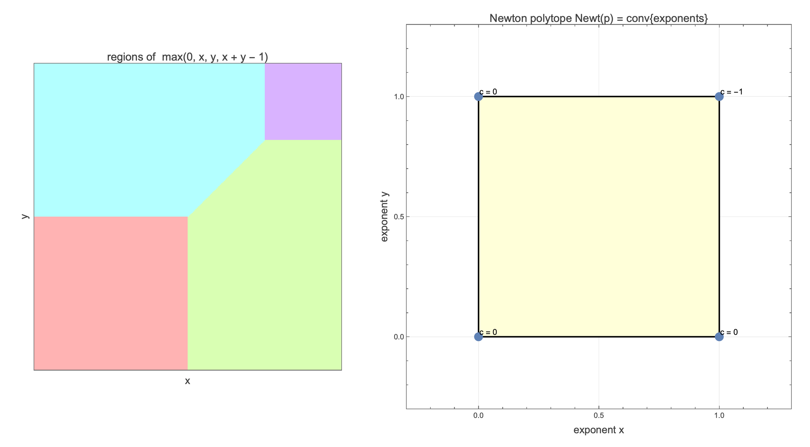

## 5. Tropical eigenvalues — Karp's algorithm

For a square tropical matrix `A` the role of the eigenvalue is played
by the *maximum mean cycle weight* of the associated weighted digraph.
Karp's algorithm computes it in `O(n³)`.

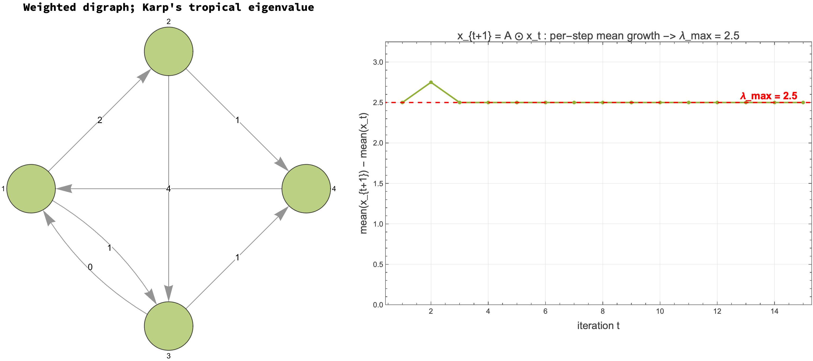

The iterates `x_{t+1} = A ⊙ x_t` then grow at rate `λ_max` per step.

---

## 6. ReLU = the tropical sum `0 ⊕ x`

Everything above stands on its own. Now we cross over to neural
networks. The bridge: **ReLU is the unit operation of the max-plus
semiring**.

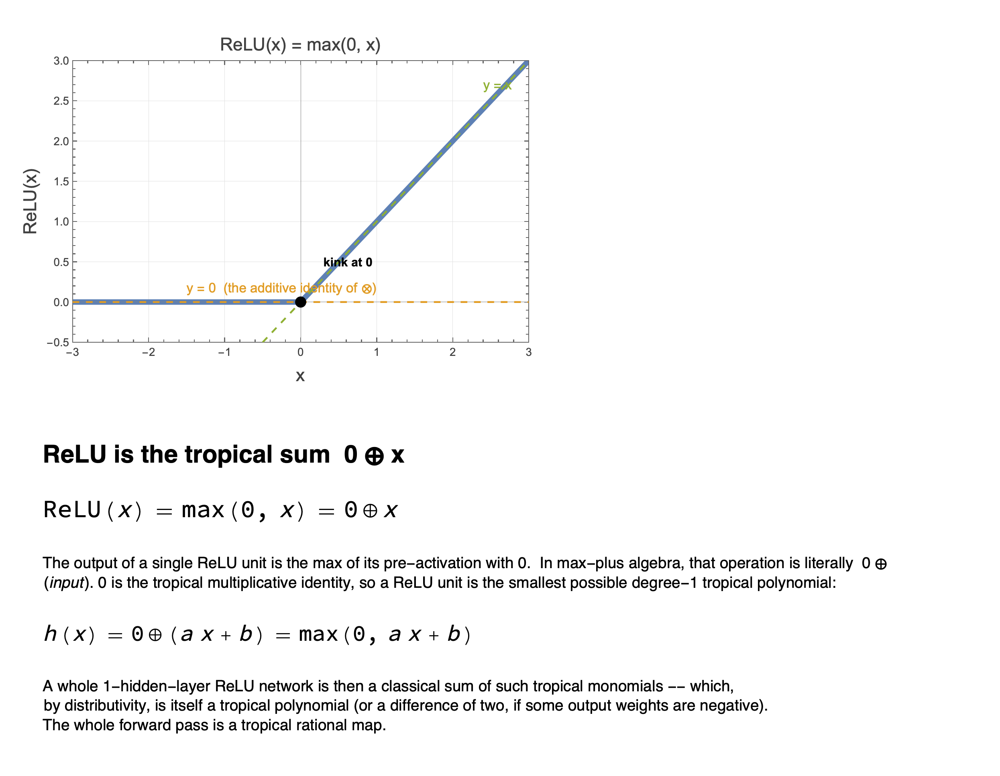

## 7. The decisive identity

A 1-hidden-layer ReLU classifier is a *classical sum* of ReLU units.
The identity that lets us turn that classical sum into a single
tropical polynomial is

```
max(0, A) + max(0, B)  =  max(0, A, B, A + B)
```

which, read tropically, says that the classical sum of two ReLU units
is the *tropical product* of their tropical polynomials.

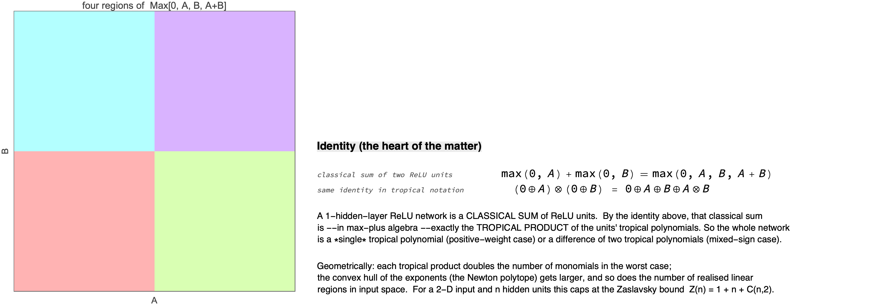

## 8. Symbolic derivation: 2 → 1 → 1 network

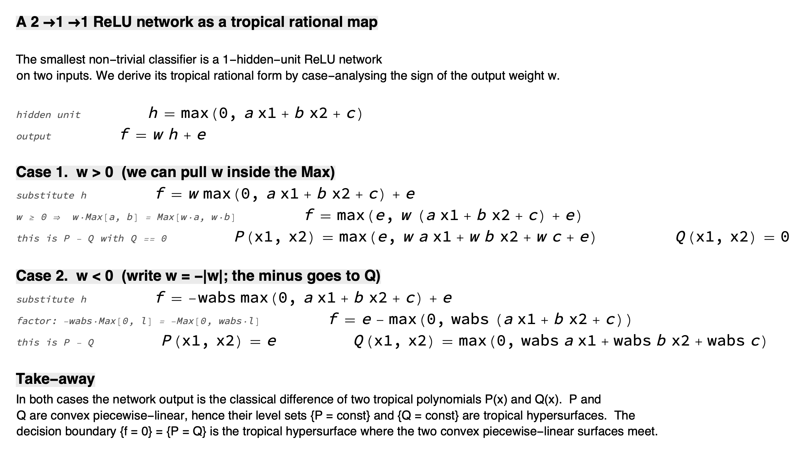

## 9. Two hidden units: a proper tropical rational

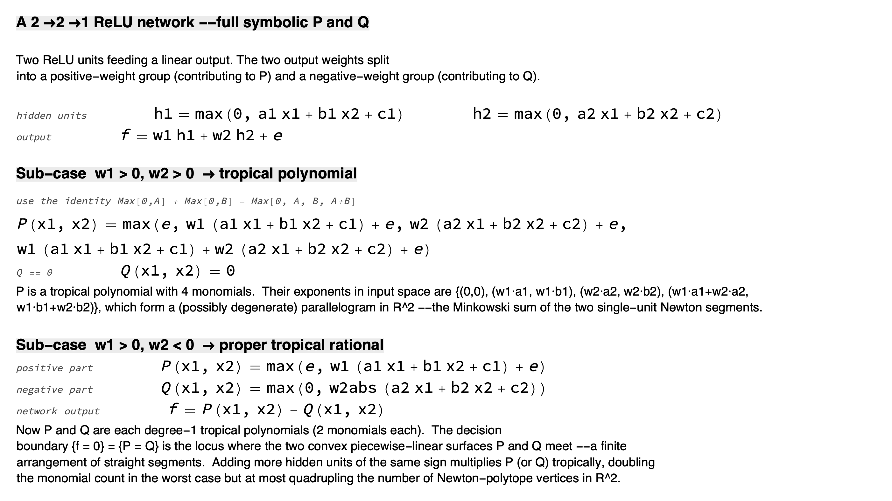

## 10. Train a tiny classifier and verify

After training a `2 → 12 → 1` ReLU MLP on two-moons:

```mathematica
fReLU[x_]    := c . Map[Max[0, #] &, A . x + b] + d;
fMaxPlus[x_] := Module[{P, Q},
  P = Sum[If[c[[j]] > 0,
              Max[0, c[[j]] (A[[j]] . x) + c[[j]] b[[j]]], 0],
           {j, Length[c]}] + Max[d, 0];
  Q = Sum[If[c[[j]] < 0,
              Max[0, -c[[j]] (A[[j]] . x) - c[[j]] b[[j]]], 0],
           {j, Length[c]}] + Max[-d, 0];
  P - Q
];
```

The two evaluators agree at machine precision on the three datasets:

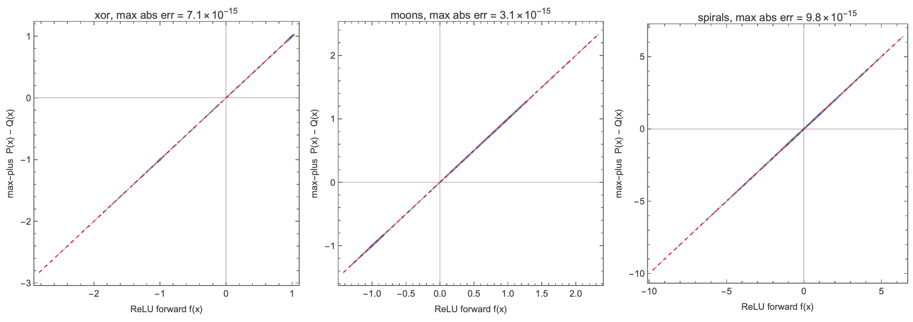

## 11. Decision boundary = tropical hypersurface

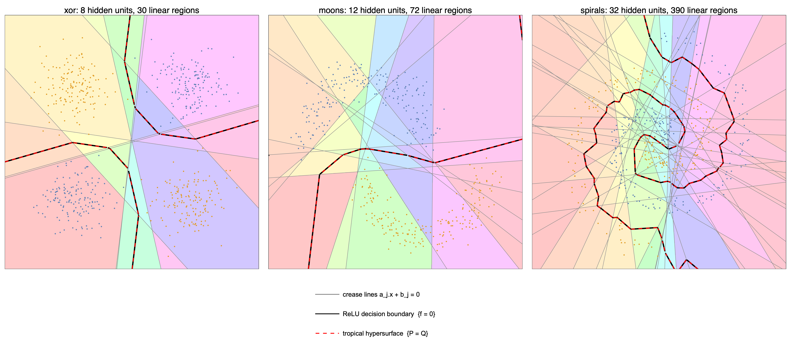

## 12. Newton polytope of the trained network

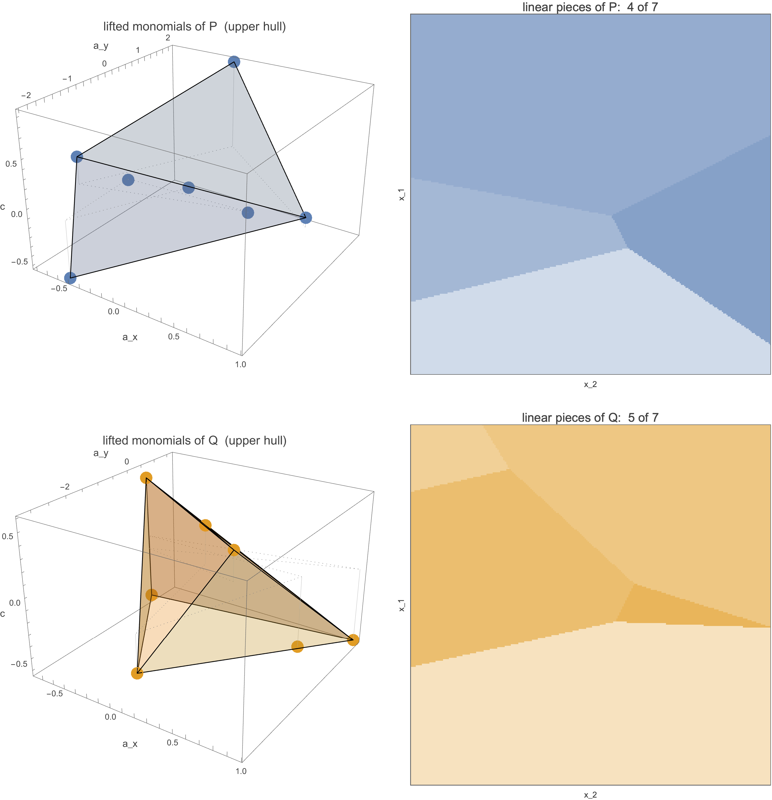

## 13. Linear regions scale like `n²`

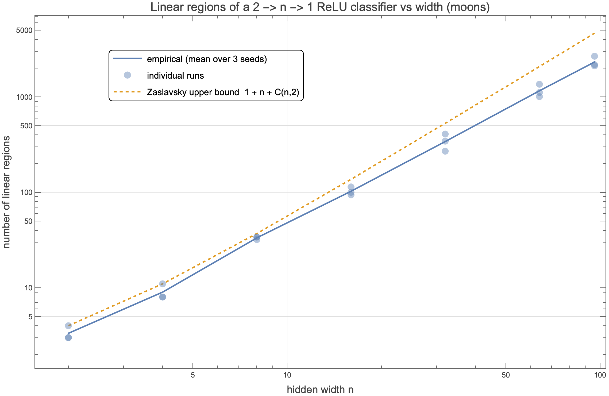

The empirical curve tracks the Zaslavsky upper bound
`Z(n) = 1 + n + C(n, 2)` at slope ≈ 2 on log-log axes.

---

## Take-away in one table

| classical / ReLU view              | tropical / max-plus view                          |
|------------------------------------|---------------------------------------------------|
| `max(0, W x + b)` per layer        | tropical polynomial in `x`                        |
| scalar output `f(x) ∈ R`           | `P(x) − Q(x)` with `P, Q` tropical polys          |
| decision boundary `{f = 0}`        | tropical hypersurface `{P = Q}`                   |
| activation crease lines            | regular subdivision of `Newt(P ⊕ Q)`              |
| linear regions vs width            | Zaslavsky bound `1 + n + C(n, 2)`                 |
| matrix-vector `W x + b`            | tropical mat-vec `A ⊙ x ⊗ b`                      |
| Bellman-Ford for shortest paths    | the *same* tropical mat-vec (min-plus)            |
| PERT longest path                  | tropical Kleene star                              |

Everything that ReLU networks do, max-plus algebra **already** does.
The two are the same object viewed through two different operator keys.

## References

- Liwen Zhang, Gregory Naitzat, Lek-Heng Lim. *Tropical Geometry of Deep Neural Networks*. ICML 2018. [arXiv:1805.07091](https://arxiv.org/abs/1805.07091).
- D. Maclagan, B. Sturmfels. *Introduction to Tropical Geometry*. AMS GSM 161 (2015).
- P. Butković. *Max-linear Systems: Theory and Algorithms*. Springer (2010).
- Wolfram Community discussion on max-plus algebra: <https://community.wolfram.com/groups/-/m/t/162609>.
